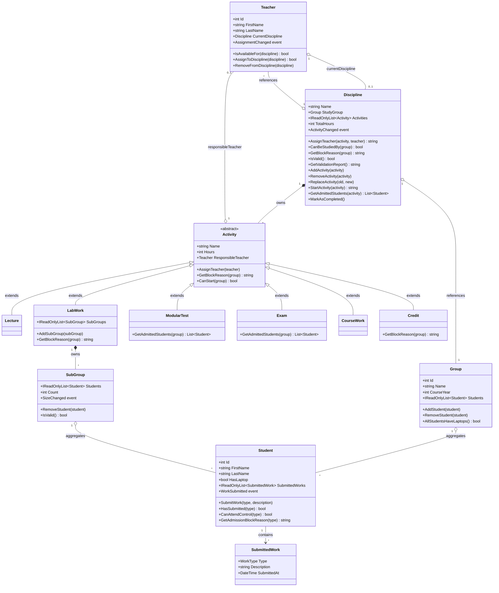

```mermaid
classDiagram
    class Student {
        +int Id
        +string FirstName
        +string LastName
        +bool HasLaptop
        +IReadOnlyList~SubmittedWork~ SubmittedWorks
        +WorkSubmitted event
        +SubmitWork(type, description)
        +HasSubmitted(type) bool
        +CanAttendControl(type) bool
        +GetAdmissionBlockReason(type) string
    }

    class SubmittedWork {
        +WorkType Type
        +string Description
        +DateTime SubmittedAt
    }

    class Group {
        +int Id
        +string Name
        +int CourseYear
        +IReadOnlyList~Student~ Students
        +AddStudent(student)
        +RemoveStudent(student)
        +AllStudentsHaveLaptops() bool
    }

    class SubGroup {
        +IReadOnlyList~Student~ Students
        +int Count
        +SizeChanged event
        +RemoveStudent(student)
        +IsValid() bool
    }

    class Teacher {
        +int Id
        +string FirstName
        +string LastName
        +Discipline CurrentDiscipline
        +AssignmentChanged event
        +IsAvailableFor(discipline) bool
        +AssignToDiscipline(discipline) bool
        +RemoveFromDiscipline(discipline)
    }

    class Activity {
        <<abstract>>
        +string Name
        +int Hours
        +Teacher ResponsibleTeacher
        +AssignTeacher(teacher)
        +GetBlockReason(group) string
        +CanStart(group) bool
    }

    class Lecture {
    }

    class LabWork {
        +IReadOnlyList~SubGroup~ SubGroups
        +AddSubGroup(subGroup)
        +GetBlockReason(group) string
    }

    class ModularTest {
        +GetAdmittedStudents(group) List~Student~
    }

    class Exam {
        +GetAdmittedStudents(group) List~Student~
    }

    class CourseWork {
    }

    class Credit {
        +GetBlockReason(group) string
    }

    class Discipline {
        +string Name
        +Group StudyGroup
        +IReadOnlyList~Activity~ Activities
        +int TotalHours
        +ActivityChanged event
        +AssignTeacher(activity, teacher) string
        +CanBeStudiedBy(group) bool
        +GetBlockReason(group) string
        +IsValid() bool
        +GetValidationReport() string
        +AddActivity(activity)
        +RemoveActivity(activity)
        +ReplaceActivity(old, new)
        +StartActivity(activity) string
        +GetAdmittedStudents(activity) List~Student~
        +MarkAsCompleted()
    }

    %% Зв'язки
    Student "1" --> "*" SubmittedWork : contains
    Group "1" o-- "*" Student : aggregates
    SubGroup "1" o-- "*" Student : aggregates
    LabWork "1" *-- "*" SubGroup : owns

    Activity <|-- Lecture : extends
    Activity <|-- LabWork : extends
    Activity <|-- ModularTest : extends
    Activity <|-- Exam : extends
    Activity <|-- CourseWork : extends
    Activity <|-- Credit : extends

    Discipline "1" *-- "*" Activity : owns
    Discipline "1" o-- "1" Group : references
    Discipline "1" o-- "*" Teacher : references

    Teacher "1" o-- "0..1" Discipline : currentDiscipline
    Activity "1" o-- "0..1" Teacher : responsibleTeacher
```